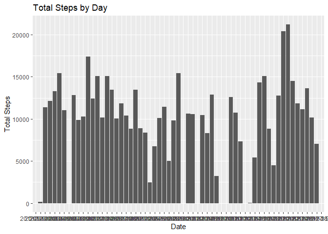
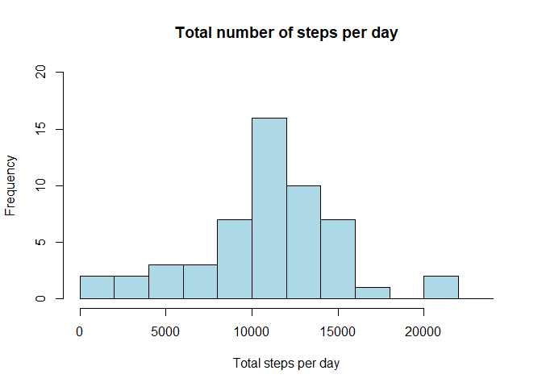
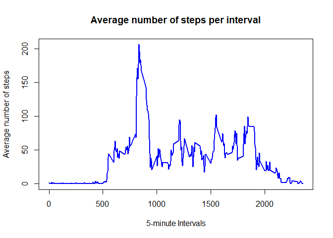
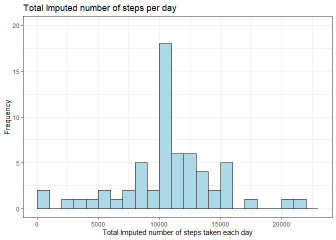
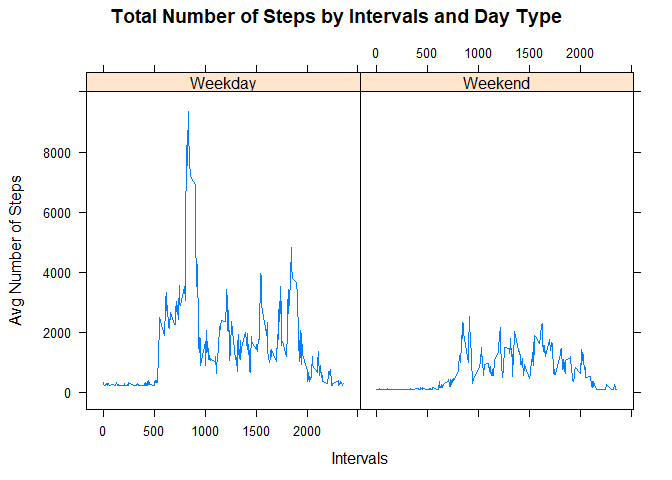

## Reproducible Research
## Week 2

## Course Project 1


### Data Background: 
This assignment makes use of data from a personal activity monitoring device, such as a Fitbit, Nike Fuelband, or Jawbone Up. This device collects data at 5 minute intervals throughout the day. The data consists of two months of data from an anonymous individual collected during the months of October and November, 2012 and include the number of steps taken in 5 minute intervals each day.

The data for this assignment can be downloaded from the course web site:  
1. Dataset: Activity monitoring data [52K]  
2. https://d396qusza40orc.cloudfront.net/repdata%2Fdata%2Factivity.zip 

The variables included in this dataset are:  
1. steps: Number of steps taking in a 5-minute interval (missing values are coded as NA)  
2. date: The date on which the measurement was taken in YYYY-MM-DD format  
3. interval: Identifier for the 5-minute interval in which measurement was taken

The dataset is stored in a comma-separated-value (CSV) file and there are a total of 17,568 observations in this dataset.

### 1. a) Load and preprocess data

```r
if(!file.exists("data")){
        dir.create("data")}

## Download Dataset.zip from Web
fileUrl <- "https://d396qusza40orc.cloudfront.net/repdata%2Fdata%2Factivity.zip"
filepath <- "./data/repdata_data_activity.zip"
download.file(fileUrl, destfile = filepath) 

## unzip repdata_data_activity.zip and Read data
unzip(zipfile="./data/repdata_data_activity.zip", exdir="C:/Users/raeby/Desktop/data")
list.files("C:/Users/raeby/Desktop/data")
```

```
## [1] "activity.csv"              "repdata_data_activity.zip"
```

```r
## Record date of downloaded file
dateDownloaded <- date()
dateDownloaded
```

```
## [1] "Tue Feb 16 23:13:40 2021"
```

### 1. b) Process/transform the data into a format suitable for analysis

```r
ActivityData <-  read.csv("./data/activity.csv", sep=",", header=TRUE)
head(ActivityData)
```

```
##   steps       date interval
## 1    NA 2012-10-01        0
## 2    NA 2012-10-01        5
## 3    NA 2012-10-01       10
## 4    NA 2012-10-01       15
## 5    NA 2012-10-01       20
## 6    NA 2012-10-01       25
```

```r
tail(ActivityData)
```

```
##       steps       date interval
## 17563    NA 2012-11-30     2330
## 17564    NA 2012-11-30     2335
## 17565    NA 2012-11-30     2340
## 17566    NA 2012-11-30     2345
## 17567    NA 2012-11-30     2350
## 17568    NA 2012-11-30     2355
```

```r
summary(ActivityData)
```

```
##      steps            date              interval     
##  Min.   :  0.00   Length:17568       Min.   :   0.0  
##  1st Qu.:  0.00   Class :character   1st Qu.: 588.8  
##  Median :  0.00   Mode  :character   Median :1177.5  
##  Mean   : 37.38                      Mean   :1177.5  
##  3rd Qu.: 12.00                      3rd Qu.:1766.2  
##  Max.   :806.00                      Max.   :2355.0  
##  NA's   :2304
```

```r
str(ActivityData)
```

```
## 'data.frame':	17568 obs. of  3 variables:
##  $ steps   : int  NA NA NA NA NA NA NA NA NA NA ...
##  $ date    : chr  "2012-10-01" "2012-10-01" "2012-10-01" "2012-10-01" ...
##  $ interval: int  0 5 10 15 20 25 30 35 40 45 ...
```

### 2. What is mean total number of steps taken per day?  
For this part of the assignment, ignore the missing values in the dataset. 

### 2. a) Calculation of Total Number of Steps taken per day

```r
TotalStepsDay <- ActivityData %>%
        group_by(date) %>%
        summarize(steps=sum(steps, na.rm=TRUE))
TotalStepsDay
```

```
## # A tibble: 61 x 2
##    date       steps
##  * <chr>      <int>
##  1 2012-10-01     0
##  2 2012-10-02   126
##  3 2012-10-03 11352
##  4 2012-10-04 12116
##  5 2012-10-05 13294
##  6 2012-10-06 15420
##  7 2012-10-07 11015
##  8 2012-10-08     0
##  9 2012-10-09 12811
## 10 2012-10-10  9900
## # ... with 51 more rows
```

```r
summary(TotalStepsDay)
```

```
##      date               steps      
##  Length:61          Min.   :    0  
##  Class :character   1st Qu.: 6778  
##  Mode  :character   Median :10395  
##                     Mean   : 9354  
##                     3rd Qu.:12811  
##                     Max.   :21194
```
### Plot: Total Steps by Day   

```r
ggplot(TotalStepsDay, aes(x=date, y=steps)) + geom_bar(stat = "identity") + 
  ylab("Total Steps") + xlab("Date") + ggtitle("Total Steps by Day") 
```

<!-- -->

```r
png("plot1.png")
ggplot(TotalStepsDay, aes(x=date, y=steps)) + geom_bar(stat = "identity") + 
  ylab("Total Steps") + xlab("Date") + ggtitle("Total Steps by Day") 
dev.off()
```

```
## png 
##   2
```

### Mean of Total Number of Steps per day

```r
MeanTotalSteps <- aggregate(steps ~ date, ActivityData, sum, na.rm=TRUE)
summary(MeanTotalSteps)
```

```
##      date               steps      
##  Length:53          Min.   :   41  
##  Class :character   1st Qu.: 8841  
##  Mode  :character   Median :10765  
##                     Mean   :10766  
##                     3rd Qu.:13294  
##                     Max.   :21194
```
### 2. b) Histogram Plot: Mean of Total Steps by per day 

```r
hist(MeanTotalSteps$steps, main = "Total number of steps per day", xlab = "Total steps per day", 
      ylab = "Frequency", col = "light blue", ylim=c(0,20), breaks = seq(0,25000, by=2000))
```

<!-- -->

```r
png("plot2.png")
hist(MeanTotalSteps$steps, main = "Total number of steps per day", xlab = "Total steps per day", 
      ylab = "Frequency", col = "light blue", ylim=c(0,20), breaks = seq(0,25000, by=2000))
dev.off()
```

```
## png 
##   2
```

### 2. c)	Calculation and report the mean and median number of steps taken per day 
For this part of the assignment, ignore the missing values in the dataset

```r
Mean_steps <- mean(MeanTotalSteps$steps, na.rm=TRUE)
Mean_steps
```

```
## [1] 10766.19
```

```r
Median_steps <- median(MeanTotalSteps$steps, na.rm=TRUE)
Median_steps
```

```
## [1] 10765
```

### 3. What is the average daily activity pattern?
a)	Make a time series plot (i.e.  type = "l") of the 5-minute interval (x-axis) and the average number of steps taken, averaged across all days (y-axis)
b)	Which 5-minute interval, on average across all the days in the dataset, contains the maximum number of steps?     

### Time series analysis of the 5-minute interval (x-axis)     

```r
Interval_steps <- ActivityData %>%
        group_by(interval) %>%
        summarize(mean_steps=mean(steps, na.rm=TRUE))
Interval_steps
```

```
## # A tibble: 288 x 2
##    interval mean_steps
##  *    <int>      <dbl>
##  1        0     1.72  
##  2        5     0.340 
##  3       10     0.132 
##  4       15     0.151 
##  5       20     0.0755
##  6       25     2.09  
##  7       30     0.528 
##  8       35     0.868 
##  9       40     0     
## 10       45     1.47  
## # ... with 278 more rows
```

```r
tail(Interval_steps)
```

```
## # A tibble: 6 x 2
##   interval mean_steps
##      <int>      <dbl>
## 1     2330      2.60 
## 2     2335      4.70 
## 3     2340      3.30 
## 4     2345      0.642
## 5     2350      0.226
## 6     2355      1.08
```

```r
summary(Interval_steps)
```

```
##     interval        mean_steps     
##  Min.   :   0.0   Min.   :  0.000  
##  1st Qu.: 588.8   1st Qu.:  2.486  
##  Median :1177.5   Median : 34.113  
##  Mean   :1177.5   Mean   : 37.383  
##  3rd Qu.:1766.2   3rd Qu.: 52.835  
##  Max.   :2355.0   Max.   :206.170
```
### 3. a) Plot: Time series (i.e., type = "l") of the 5-minute interval (x-axis) 

```r
plot(Interval_steps$interval, Interval_steps$mean_steps, type = "l", 
     col="blue", lwd = 2, xlab="5-minute Intervals", ylab="Average number of steps", 
     main="Average number of steps per interval")
```

<!-- -->

```r
png("plot3.png")
plot(Interval_steps$interval, Interval_steps$mean_steps, type = "l", 
     col="blue", lwd = 2, xlab="5-minute Intervals", ylab="Average number of steps", 
     main="Average number of steps per interval")
dev.off()
```

```
## png 
##   2
```

### 3. b) Analysis of 5-minute interval, on average across all the days in the dataset, and which interval contains the maximum number of steps

```r
max_Interval <- Interval_steps %>%
        select(interval, mean_steps) %>% 
        filter(mean_steps==max(mean_steps))
max_Interval
```

```
## # A tibble: 1 x 2
##   interval mean_steps
##      <int>      <dbl>
## 1      835       206.
```

```r
max_Interval[1,1]
```

```
## # A tibble: 1 x 1
##   interval
##      <int>
## 1      835
```

## 4. Imputing missing values
Note that there are a number of days/intervals where there are missing values (coded as NA). The presence of missing days may introduce bias into some calculations or summaries of the data.  
a) Calculate and report the total number of missing values in the dataset (i.e. the total number of rows with  NAs)  
b) Devise a strategy for filling in all of the missing values in the dataset. The strategy does not need to be sophisticated. For example, you could use the mean/median for that day, or the mean for that 5-minute interval, etc.  
c) Create a new dataset that is equal to the original dataset but with the missing data filled in.  
d) Make a histogram of the total number of steps taken each day. Calculate and report the mean and median total number of steps taken per day. Do these values differ from the estimates from the first part of the assignment? What is the impact of imputing missing data on the estimates of the total daily number of steps?

### 4.a) Calculate the total number of missing values in the dataset (i.e. the total number of rows with  NAs)  

```r
missing_values <- is.na(ActivityData$steps)
num_missing_values <- sum(is.na(ActivityData$steps))
num_missing_values
```

```
## [1] 2304
```
### 4.b) Devise a strategy for filling in all of the missing values in the dataset.   
Using the mean steps per interval.

```r
mean_steps_interval <- mean(Interval_steps$mean_steps, is.na=TRUE)
mean_steps_interval
```

```
## [1] 37.3826
```
### 4.c) Create a new dataset that is equal to the original dataset but with the missing data filled in.

```r
Imputed_ActivityData <- ActivityData
Imputed_ActivityData[missing_values, 1] <- mean_steps_interval
head(Imputed_ActivityData)
```

```
##     steps       date interval
## 1 37.3826 2012-10-01        0
## 2 37.3826 2012-10-01        5
## 3 37.3826 2012-10-01       10
## 4 37.3826 2012-10-01       15
## 5 37.3826 2012-10-01       20
## 6 37.3826 2012-10-01       25
```

```r
dim(Imputed_ActivityData)
```

```
## [1] 17568     3
```

```r
summary(Imputed_ActivityData)
```

```
##      steps            date              interval     
##  Min.   :  0.00   Length:17568       Min.   :   0.0  
##  1st Qu.:  0.00   Class :character   1st Qu.: 588.8  
##  Median :  0.00   Mode  :character   Median :1177.5  
##  Mean   : 37.38                      Mean   :1177.5  
##  3rd Qu.: 37.38                      3rd Qu.:1766.2  
##  Max.   :806.00                      Max.   :2355.0
```

4.d.1) Make a histogram of the total number of steps taken each day.   
4.d.2) Calculate and report the mean and median total number of steps taken per day.  
4.d.3) Do these values differ from the estimates from the first part of the assignment?  
4.d.4) What is the impact of imputing missing data on the estimates of the total daily number of steps?

### Plot Analysis for Mean Imputed Total Steps taken per day.   
For this part of the assignment, missing values are in the new dataset.

```r
Total_Imputed_steps_per_day <- aggregate(steps~date, Imputed_ActivityData, sum)
str(Total_Imputed_steps_per_day)
```

```
## 'data.frame':	61 obs. of  2 variables:
##  $ date : chr  "2012-10-01" "2012-10-02" "2012-10-03" "2012-10-04" ...
##  $ steps: num  10766 126 11352 12116 13294 ...
```

### 4.d.1) ggplot Histogram Plot  

```r
g <- ggplot(Total_Imputed_steps_per_day, aes(steps))
g + geom_histogram(boundary=0, binwidth=1000, col="black", fill="lightblue") +
        xlim(0, 23000) + scale_y_continuous(limits=c(0,20)) +
  xlab("Total Imputed number of steps taken each day") + 
  ylab("Frequency") + ggtitle("Total Imputed number of steps per day") +
        theme_bw() 
```

<!-- -->

```r
png("plot4.png")
g <- ggplot(Total_Imputed_steps_per_day, aes(steps))
g + geom_histogram(boundary=0, binwidth=1000, col="black", fill="lightblue") +
        xlim(0, 23000) + scale_y_continuous(limits=c(0,20)) +
  xlab("Total Imputed number of steps taken each day") + 
  ylab("Frequency") + ggtitle("Total Imputed number of steps per day") +
        theme_bw() 
dev.off()
```

```
## png 
##   2
```

### 4.d.2) What are the mean and median number of steps taken per day?   

```r
Mean_Imputed_steps <- mean(Total_Imputed_steps_per_day$steps)
Mean_Imputed_steps
```

```
## [1] 10766.19
```

```r
Median_Imputed_steps <- median(Total_Imputed_steps_per_day$steps)
Median_Imputed_steps
```

```
## [1] 10766.19
```
### 4.d.3) Do these values differ from the estimates from the first part of the assignment? 

```r
Mean_steps <- mean(MeanTotalSteps$steps, na.rm=TRUE)
Mean_steps
```

```
## [1] 10766.19
```

```r
Median_steps <- median(MeanTotalSteps$steps, na.rm=TRUE)
Median_steps
```

```
## [1] 10765
```
#### Imputed Median Step has changed only slightly, the Imputed Mean Step is nearly identical.

### 4.d.4) What is the impact of imputing missing data on the estimates of the total daily number of steps?

```r
TotalImputedStepsDay <- Total_Imputed_steps_per_day %>%
            group_by(date) %>%
            summarize(steps=sum(steps, na.rm=TRUE))
summary(TotalImputedStepsDay)
```

```
##      date               steps      
##  Length:61          Min.   :   41  
##  Class :character   1st Qu.: 9819  
##  Mode  :character   Median :10766  
##                     Mean   :10766  
##                     3rd Qu.:12811  
##                     Max.   :21194
```

```r
summary(TotalStepsDay)
```

```
##      date               steps      
##  Length:61          Min.   :    0  
##  Class :character   1st Qu.: 6778  
##  Mode  :character   Median :10395  
##                     Mean   : 9354  
##                     3rd Qu.:12811  
##                     Max.   :21194
```
#### The Mean and the Median see similar, although significant changes.

## 5. Are there differences in activity patterns between weekdays and weekends?
For this part the weekdays() function may be of some help here. Use the dataset with the filled-in missing values for this part.

5.a) Create a new factor variable in the dataset with two levels – “weekday” and “weekend” indicating whether a given date is a weekday or weekend day.
5.b) Make a panel plot containing a time series plot (i.e. type = "l") of the 5-minute interval (x-axis) and the average number of steps taken, averaged across all weekday days or weekend days (y-axis). See the README file in the GitHub repository to see an example of what this plot should look like using simulated data.

### 5.a) Calculation of new factor variable in the dataset with two levels – “weekday” and “weekend” indicating whether a given date is a weekday or weekend day.

```r
Imputed_ActivityData$date <- as.Date(Imputed_ActivityData$date, format = "%Y-%m-%d")

Weekdays_ActivityData <- Imputed_ActivityData %>%
        mutate(DayType= ifelse(weekdays(Imputed_ActivityData$date)=="Saturday" | weekdays(Imputed_ActivityData$date)=="Sunday", "Weekend", "Weekday"))
head(Weekdays_ActivityData)
```

```
##     steps       date interval DayType
## 1 37.3826 2012-10-01        0 Weekday
## 2 37.3826 2012-10-01        5 Weekday
## 3 37.3826 2012-10-01       10 Weekday
## 4 37.3826 2012-10-01       15 Weekday
## 5 37.3826 2012-10-01       20 Weekday
## 6 37.3826 2012-10-01       25 Weekday
```

```r
WeekDayTypeData <- Weekdays_ActivityData %>%
  group_by(interval, DayType) %>%
  summarize(AvgSteps=sum(steps), .groups = 'drop')

head(WeekDayTypeData)
```

```
## # A tibble: 6 x 3
##   interval DayType AvgSteps
##      <int> <chr>      <dbl>
## 1        0 Weekday    315. 
## 2        0 Weekend     74.8
## 3        5 Weekday    242. 
## 4        5 Weekend     74.8
## 5       10 Weekday    231. 
## 6       10 Weekend     74.8
```
### 5.b) Lattice Plots

```r
par(mfrow=c(2,1))
library(lattice)
with(WeekDayTypeData,
      xyplot(AvgSteps ~ interval | DayType, 
      type = "l",      
      main = "Total Number of Steps by Intervals and Day Type",
      xlab = "Intervals",
      ylab = "Avg Number of Steps"))
```

<!-- -->

```r
png("plot5.png")
par(mfrow=c(2,1))
library(lattice)
with(WeekDayTypeData,
      xyplot(AvgSteps ~ interval | DayType, 
      type = "l",      
      main = "Total Number of Steps by Intervals and Day Type",
      xlab = "Intervals",
      ylab = "Avg Number of Steps"))
dev.off()
```

```
## png 
##   2
```
